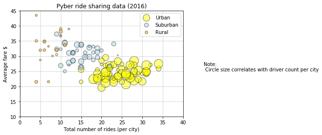
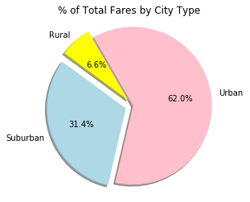
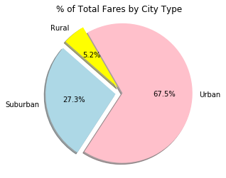
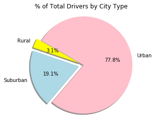

# Pyber Ride Sharing

    # Analysis
        Observed Trend-1
            Urban city tops in - total number of rides , total number of drivers , total fare
        Observed Trend-2
             Rural city tops in - average fare
        Observed Trend-3
            The minimum total rides per city in Urban cities is 15, which is greater than the maximum total rides per city in Rural cities


```python
#Import required packages 
import os
import pandas as pd
import numpy as np
import matplotlib.pyplot as plt
import seaborn as sns
#from IPython.core.interactiveshell import InteractiveShell
#InteractiveShell.ast_node_interactivity = "all"
from numpy.random import randn
```


```python
#Assign the file paths to variables
city_data = os.path.join('raw_data','city_data.csv')
ride_data = os.path.join('raw_data','ride_data.csv')
#Open CSV files 
city_PD = pd.read_csv(city_data)
ride_PD = pd.read_csv(ride_data)

#Merging both ride data and city data into a single dataframe. 
city_ride_PD = pd.merge(city_PD,ride_PD,on='city')


#city_ride_PD['datetime'] = city_ride_PD['date']
#city_ride_PD['date'] = pd.to_datetime(city_ride_PD['date']).dt.date
city_ride_PD = city_ride_PD [["city","date","fare","ride_id","driver_count","type"]]
city_ride_PD.head(5)


```


<div>
<style>
    .dataframe thead tr:only-child th {
        text-align: right;
    }

    .dataframe thead th {
        text-align: left;
    }

    .dataframe tbody tr th {
        vertical-align: top;
    }
</style>
<table border="1" class="dataframe">
  <thead>
    <tr style="text-align: right;">
      <th></th>
      <th>city</th>
      <th>date</th>
      <th>fare</th>
      <th>ride_id</th>
      <th>driver_count</th>
      <th>type</th>
    </tr>
  </thead>
  <tbody>
    <tr>
      <th>0</th>
      <td>Kelseyland</td>
      <td>2016-08-19 04:27:52</td>
      <td>5.51</td>
      <td>6246006544795</td>
      <td>63</td>
      <td>Urban</td>
    </tr>
    <tr>
      <th>1</th>
      <td>Kelseyland</td>
      <td>2016-04-17 06:59:50</td>
      <td>5.54</td>
      <td>7466473222333</td>
      <td>63</td>
      <td>Urban</td>
    </tr>
    <tr>
      <th>2</th>
      <td>Kelseyland</td>
      <td>2016-05-04 15:06:07</td>
      <td>30.54</td>
      <td>2140501382736</td>
      <td>63</td>
      <td>Urban</td>
    </tr>
    <tr>
      <th>3</th>
      <td>Kelseyland</td>
      <td>2016-01-25 20:44:56</td>
      <td>12.08</td>
      <td>1896987891309</td>
      <td>63</td>
      <td>Urban</td>
    </tr>
    <tr>
      <th>4</th>
      <td>Kelseyland</td>
      <td>2016-08-09 18:19:47</td>
      <td>17.91</td>
      <td>8784212854829</td>
      <td>63</td>
      <td>Urban</td>
    </tr>
  </tbody>
</table>
</div>


```python
#create Dataframe for the required aggreage fields. 

city_group = city_ride_PD.groupby('city')
total_rides = city_group["ride_id"].count()
avg_fare =  city_group["fare"].mean()
total_drivers = city_group["driver_count"].min()
city_type = city_group["type"].min()

City_Summary_PD = pd.DataFrame({
    "Total Rides": total_rides,
    "Total Drivers": total_drivers,
    "Average Fare" : avg_fare,
    "City_Type": city_type
})

City_Summary_PD.loc[City_Summary_PD.City_Type == 'Urban','Color'] = "yellow"
City_Summary_PD.loc[City_Summary_PD.City_Type == 'Suburban','Color'] = "lightblue"
City_Summary_PD.loc[City_Summary_PD.City_Type == 'Rural','Color'] = "orange"
City_Summary_PD.head(5)
```


<div>
<style>
    .dataframe thead tr:only-child th {
        text-align: right;
    }

    .dataframe thead th {
        text-align: left;
    }

    .dataframe tbody tr th {
        vertical-align: top;
    }
</style>
<table border="1" class="dataframe">
  <thead>
    <tr style="text-align: right;">
      <th></th>
      <th>Average Fare</th>
      <th>City_Type</th>
      <th>Total Drivers</th>
      <th>Total Rides</th>
      <th>Color</th>
    </tr>
    <tr>
      <th>city</th>
      <th></th>
      <th></th>
      <th></th>
      <th></th>
      <th></th>
    </tr>
  </thead>
  <tbody>
    <tr>
      <th>Alvarezhaven</th>
      <td>23.928710</td>
      <td>Urban</td>
      <td>21</td>
      <td>31</td>
      <td>yellow</td>
    </tr>
    <tr>
      <th>Alyssaberg</th>
      <td>20.609615</td>
      <td>Urban</td>
      <td>67</td>
      <td>26</td>
      <td>yellow</td>
    </tr>
    <tr>
      <th>Anitamouth</th>
      <td>37.315556</td>
      <td>Suburban</td>
      <td>16</td>
      <td>9</td>
      <td>lightblue</td>
    </tr>
    <tr>
      <th>Antoniomouth</th>
      <td>23.625000</td>
      <td>Urban</td>
      <td>21</td>
      <td>22</td>
      <td>yellow</td>
    </tr>
    <tr>
      <th>Aprilchester</th>
      <td>21.981579</td>
      <td>Urban</td>
      <td>49</td>
      <td>19</td>
      <td>yellow</td>
    </tr>
  </tbody>
</table>
</div>


# Bubble Plot of Ride Sharing Data


```python
#Create datframes for each city type.

urban_Summary_PD = City_Summary_PD.loc[City_Summary_PD["City_Type"] == "Urban",:]
suburban_Summary_PD = City_Summary_PD.loc[City_Summary_PD["City_Type"] == "Suburban",:]
rural_Summary_PD = City_Summary_PD.loc[City_Summary_PD["City_Type"] == "Rural",:]

#create plots
urban_plot = plt.scatter(x=urban_Summary_PD['Total Rides'], y=urban_Summary_PD['Average Fare']
                              ,marker="o",c=urban_Summary_PD['Color'], edgecolors="black"
                              ,s=urban_Summary_PD['Total Drivers']*5,alpha=0.5,label=urban_Summary_PD['City_Type'])

suburban_plot = plt.scatter(x=suburban_Summary_PD['Total Rides'], y=suburban_Summary_PD['Average Fare']
                              ,marker="o",c=suburban_Summary_PD['Color'], edgecolors="black"
                              ,s=suburban_Summary_PD['Total Drivers']*5,alpha=0.5,label=suburban_Summary_PD['City_Type'])

rural_plot = plt.scatter(x=rural_Summary_PD['Total Rides'], y=rural_Summary_PD['Average Fare']
                              ,marker="o",c=rural_Summary_PD['Color'], edgecolors="black"
                              ,s=rural_Summary_PD['Total Drivers']*5,alpha=0.5,label=rural_Summary_PD['City_Type'])

#set plot features
plt.axis([0, 40, 10, 45])
plt.grid(linestyle='-', linewidth=0.5)
plt.xlabel("Total number of rides (per city)")
plt.ylabel("Average fare $")
plt.title("Pyber ride sharing data (2016)")
plt.text(45, 25, 'Note: \n Circle size correlates with driver count per city')
plt.legend((urban_plot, suburban_plot, rural_plot),('Urban', 'Suburban','Rural'))

plt.show()


```





# Total Fares by City Type


```python
#create the percentage total fares by city type
cityType_total_fare_percent = (city_ride_PD.groupby('type')['fare'].sum()/sum(city_ride_PD['fare']))*100

#create Pie chart 
cityType_total_fare_percent.plot.pie(figsize=(5, 4),shadow=True,startangle=120 
                                     , title = '% of Total Fares by City Type' ,autopct="%1.1f%%"
                                    ,explode=[0.1,0.1,0],colors=['yellow','lightblue','pink'])
#set plot features 
plt.axis("equal")
plt.ylabel(" ")
plt.show()
```





# Total Rides by City Type


```python
#create the percentage total rides by city type
cityType_total_ride_percent = (city_ride_PD.groupby('type')['ride_id'].count()/city_ride_PD['ride_id'].count())*100

#create Pie chart 
cityType_total_ride_percent.plot.pie(figsize=(5, 4),shadow=True,startangle=120 
                                     , title = '% of Total Fares by City Type' ,autopct="%1.1f%%"
                                    ,explode=[0.1,0.1,0],colors=['yellow','lightblue','pink'])
#set plot features
plt.axis("equal")
plt.ylabel(" ")
plt.show()
```





# Total Drivers by City Type


```python
#create the percentage total drivers by city type
cityType_total_driver_percent = (city_PD.groupby('type')['driver_count'].sum()/sum(city_PD['driver_count']))*100

#create Pie chart 
cityType_total_driver_percent.plot.pie(figsize=(5, 4),shadow=True,startangle=150 
                                     , title = '% of Total Drivers by City Type' ,autopct="%1.1f%%"
                                    ,explode=[0.1,0.1,0],colors=['yellow','lightblue','pink'])
#set plot features
plt.axis("equal")
plt.ylabel(" ")
plt.show()


```




