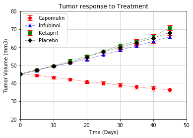
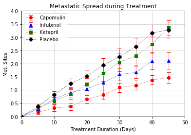
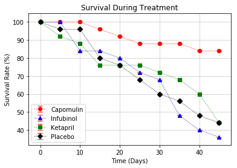
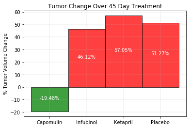

# Pymaceuticals Inc.

    # Analysis
        Observed Trend 1
            Overall Capomulin had good affects - Tumor volume decreased over time
        Observed Trend 2
            Survival rate is high for Capomulin
            Survival rate is losw for Infubinol
        Observed Trend 3
            Increase in total Metastatic Sites  very low for Capomulin
            Though the incline in metastatic sits is low for Ketrapil compared to Placebo, the fianl surival count by the end of treatment(day-45) is same for both. 
            


```python
#import required packages
import os
import pandas as pd
import numpy as np
import matplotlib.pyplot as plt
#from IPython.core.interactiveshell import InteractiveShell
#InteractiveShell.ast_node_interactivity = "all"
from numpy.random import randn
```


```python
#assign the file names to variables
clinicaltrial_data = os.path.join('raw_data','2_clinicaltrial_data.csv')
mouse_drug_data = os.path.join('raw_data','2_mouse_drug_data.csv')

#create data frames to hold each of these data sets
clinicaltrial_DF = pd.read_csv(clinicaltrial_data)
mouse_drug_DF = pd.read_csv(mouse_drug_data)

#merge the 2 datasets into a single dataset
clinicaltrial_mouseDrug_DF = pd.merge(clinicaltrial_DF,mouse_drug_DF,on='Mouse ID')
clinicaltrial_mouseDrug_DF['Tumor Volume (mm3)'] = clinicaltrial_mouseDrug_DF['Tumor Volume (mm3)'].round(1)
clinicaltrial_mouseDrug_DF.head(5)

```


<div>
<style scoped>
    .dataframe tbody tr th:only-of-type {
        vertical-align: middle;
    }

    .dataframe tbody tr th {
        vertical-align: top;
    }

    .dataframe thead th {
        text-align: right;
    }
</style>
<table border="1" class="dataframe">
  <thead>
    <tr style="text-align: right;">
      <th></th>
      <th>Mouse ID</th>
      <th>Timepoint</th>
      <th>Tumor Volume (mm3)</th>
      <th>Metastatic Sites</th>
      <th>Drug</th>
    </tr>
  </thead>
  <tbody>
    <tr>
      <th>0</th>
      <td>b128</td>
      <td>0</td>
      <td>45.0</td>
      <td>0</td>
      <td>Capomulin</td>
    </tr>
    <tr>
      <th>1</th>
      <td>b128</td>
      <td>5</td>
      <td>45.7</td>
      <td>0</td>
      <td>Capomulin</td>
    </tr>
    <tr>
      <th>2</th>
      <td>b128</td>
      <td>10</td>
      <td>43.3</td>
      <td>0</td>
      <td>Capomulin</td>
    </tr>
    <tr>
      <th>3</th>
      <td>b128</td>
      <td>15</td>
      <td>43.8</td>
      <td>0</td>
      <td>Capomulin</td>
    </tr>
    <tr>
      <th>4</th>
      <td>b128</td>
      <td>20</td>
      <td>42.7</td>
      <td>0</td>
      <td>Capomulin</td>
    </tr>
  </tbody>
</table>
</div>


# Tumor Response to Treatment


```python
#create a data group by drug name and timepoint
tumorResponse_Group = clinicaltrial_mouseDrug_DF.groupby(['Drug','Timepoint'])

#Avg tumor volume by drug and timepoint
tumorResponse = tumorResponse_Group['Tumor Volume (mm3)'].mean()
tumorResponse_DF = pd.DataFrame(tumorResponse)

tumorResponse_DF.head()
```


<div>
<style scoped>
    .dataframe tbody tr th:only-of-type {
        vertical-align: middle;
    }

    .dataframe tbody tr th {
        vertical-align: top;
    }

    .dataframe thead th {
        text-align: right;
    }
</style>
<table border="1" class="dataframe">
  <thead>
    <tr style="text-align: right;">
      <th></th>
      <th></th>
      <th>Tumor Volume (mm3)</th>
    </tr>
    <tr>
      <th>Drug</th>
      <th>Timepoint</th>
      <th></th>
    </tr>
  </thead>
  <tbody>
    <tr>
      <th rowspan="5" valign="top">Capomulin</th>
      <th>0</th>
      <td>45.000000</td>
    </tr>
    <tr>
      <th>5</th>
      <td>44.268000</td>
    </tr>
    <tr>
      <th>10</th>
      <td>43.080000</td>
    </tr>
    <tr>
      <th>15</th>
      <td>42.066667</td>
    </tr>
    <tr>
      <th>20</th>
      <td>40.717391</td>
    </tr>
  </tbody>
</table>
</div>


```python
#find the error over tumor volume
tumorResponseError = tumorResponse_Group['Tumor Volume (mm3)'].sem()
tumorResponseError_DF = pd.DataFrame(tumorResponseError)
tumorResponseError_DF.head(5)

```


<div>
<style scoped>
    .dataframe tbody tr th:only-of-type {
        vertical-align: middle;
    }

    .dataframe tbody tr th {
        vertical-align: top;
    }

    .dataframe thead th {
        text-align: right;
    }
</style>
<table border="1" class="dataframe">
  <thead>
    <tr style="text-align: right;">
      <th></th>
      <th></th>
      <th>Tumor Volume (mm3)</th>
    </tr>
    <tr>
      <th>Drug</th>
      <th>Timepoint</th>
      <th></th>
    </tr>
  </thead>
  <tbody>
    <tr>
      <th rowspan="5" valign="top">Capomulin</th>
      <th>0</th>
      <td>0.000000</td>
    </tr>
    <tr>
      <th>5</th>
      <td>0.449137</td>
    </tr>
    <tr>
      <th>10</th>
      <td>0.704036</td>
    </tr>
    <tr>
      <th>15</th>
      <td>0.837107</td>
    </tr>
    <tr>
      <th>20</th>
      <td>0.908820</td>
    </tr>
  </tbody>
</table>
</div>


```python
#Pivot the data frame so that the data would be available for each drug 
tumorResponse_DF = tumorResponse_DF.reset_index()
tumorResponse_PVT_DF = tumorResponse_DF.pivot(index='Timepoint', columns='Drug', values='Tumor Volume (mm3)')
tumorResponse_PVT_DF.head(10)

tumorResponseError_DF = tumorResponseError_DF.reset_index()
tumorResponseError_PVT_DF = tumorResponseError_DF.pivot(index='Timepoint', columns='Drug', values='Tumor Volume (mm3)')
tumorResponseError_PVT_DF.head(10)

```


<div>
<style scoped>
    .dataframe tbody tr th:only-of-type {
        vertical-align: middle;
    }

    .dataframe tbody tr th {
        vertical-align: top;
    }

    .dataframe thead th {
        text-align: right;
    }
</style>
<table border="1" class="dataframe">
  <thead>
    <tr style="text-align: right;">
      <th>Drug</th>
      <th>Capomulin</th>
      <th>Ceftamin</th>
      <th>Infubinol</th>
      <th>Ketapril</th>
      <th>Naftisol</th>
      <th>Placebo</th>
      <th>Propriva</th>
      <th>Ramicane</th>
      <th>Stelasyn</th>
      <th>Zoniferol</th>
    </tr>
    <tr>
      <th>Timepoint</th>
      <th></th>
      <th></th>
      <th></th>
      <th></th>
      <th></th>
      <th></th>
      <th></th>
      <th></th>
      <th></th>
      <th></th>
    </tr>
  </thead>
  <tbody>
    <tr>
      <th>0</th>
      <td>45.000000</td>
      <td>45.000000</td>
      <td>45.000000</td>
      <td>45.000000</td>
      <td>45.000000</td>
      <td>45.000000</td>
      <td>45.000000</td>
      <td>45.000000</td>
      <td>45.000000</td>
      <td>45.000000</td>
    </tr>
    <tr>
      <th>5</th>
      <td>44.268000</td>
      <td>46.504762</td>
      <td>47.076000</td>
      <td>47.400000</td>
      <td>46.791304</td>
      <td>47.133333</td>
      <td>47.256000</td>
      <td>43.948000</td>
      <td>47.528000</td>
      <td>46.850000</td>
    </tr>
    <tr>
      <th>10</th>
      <td>43.080000</td>
      <td>48.290000</td>
      <td>49.409524</td>
      <td>49.577273</td>
      <td>48.700000</td>
      <td>49.416667</td>
      <td>49.095652</td>
      <td>42.533333</td>
      <td>49.465217</td>
      <td>48.686364</td>
    </tr>
    <tr>
      <th>15</th>
      <td>42.066667</td>
      <td>50.089474</td>
      <td>51.290476</td>
      <td>52.400000</td>
      <td>50.933333</td>
      <td>51.360000</td>
      <td>51.070588</td>
      <td>41.495833</td>
      <td>51.534783</td>
      <td>50.780952</td>
    </tr>
    <tr>
      <th>20</th>
      <td>40.717391</td>
      <td>52.150000</td>
      <td>53.195000</td>
      <td>54.926316</td>
      <td>53.640000</td>
      <td>54.357895</td>
      <td>53.341176</td>
      <td>40.234783</td>
      <td>54.076190</td>
      <td>53.170588</td>
    </tr>
    <tr>
      <th>25</th>
      <td>39.945455</td>
      <td>54.288889</td>
      <td>55.722222</td>
      <td>57.684211</td>
      <td>56.722222</td>
      <td>57.476471</td>
      <td>55.485714</td>
      <td>38.978261</td>
      <td>56.163158</td>
      <td>55.450000</td>
    </tr>
    <tr>
      <th>30</th>
      <td>38.781818</td>
      <td>56.762500</td>
      <td>58.300000</td>
      <td>60.994444</td>
      <td>59.560000</td>
      <td>59.806667</td>
      <td>58.200000</td>
      <td>38.700000</td>
      <td>59.827778</td>
      <td>57.713333</td>
    </tr>
    <tr>
      <th>35</th>
      <td>37.822727</td>
      <td>58.828571</td>
      <td>60.725000</td>
      <td>63.370588</td>
      <td>62.673333</td>
      <td>62.428571</td>
      <td>60.360000</td>
      <td>37.447619</td>
      <td>62.443750</td>
      <td>60.085714</td>
    </tr>
    <tr>
      <th>40</th>
      <td>36.961905</td>
      <td>61.471429</td>
      <td>63.160000</td>
      <td>66.066667</td>
      <td>65.600000</td>
      <td>65.050000</td>
      <td>63.044444</td>
      <td>36.585000</td>
      <td>65.358333</td>
      <td>62.914286</td>
    </tr>
    <tr>
      <th>45</th>
      <td>36.233333</td>
      <td>64.115385</td>
      <td>65.755556</td>
      <td>70.672727</td>
      <td>69.276923</td>
      <td>68.072727</td>
      <td>66.271429</td>
      <td>34.960000</td>
      <td>68.436364</td>
      <td>65.957143</td>
    </tr>
  </tbody>
</table>
</div>


<div>
<style scoped>
    .dataframe tbody tr th:only-of-type {
        vertical-align: middle;
    }

    .dataframe tbody tr th {
        vertical-align: top;
    }

    .dataframe thead th {
        text-align: right;
    }
</style>
<table border="1" class="dataframe">
  <thead>
    <tr style="text-align: right;">
      <th>Drug</th>
      <th>Capomulin</th>
      <th>Ceftamin</th>
      <th>Infubinol</th>
      <th>Ketapril</th>
      <th>Naftisol</th>
      <th>Placebo</th>
      <th>Propriva</th>
      <th>Ramicane</th>
      <th>Stelasyn</th>
      <th>Zoniferol</th>
    </tr>
    <tr>
      <th>Timepoint</th>
      <th></th>
      <th></th>
      <th></th>
      <th></th>
      <th></th>
      <th></th>
      <th></th>
      <th></th>
      <th></th>
      <th></th>
    </tr>
  </thead>
  <tbody>
    <tr>
      <th>0</th>
      <td>0.000000</td>
      <td>0.000000</td>
      <td>0.000000</td>
      <td>0.000000</td>
      <td>0.000000</td>
      <td>0.000000</td>
      <td>0.000000</td>
      <td>0.000000</td>
      <td>0.000000</td>
      <td>0.000000</td>
    </tr>
    <tr>
      <th>5</th>
      <td>0.449137</td>
      <td>0.164096</td>
      <td>0.235533</td>
      <td>0.266584</td>
      <td>0.201272</td>
      <td>0.216834</td>
      <td>0.233172</td>
      <td>0.485356</td>
      <td>0.240175</td>
      <td>0.189584</td>
    </tr>
    <tr>
      <th>10</th>
      <td>0.704036</td>
      <td>0.234734</td>
      <td>0.283339</td>
      <td>0.356324</td>
      <td>0.321307</td>
      <td>0.400980</td>
      <td>0.377399</td>
      <td>0.719240</td>
      <td>0.433280</td>
      <td>0.263944</td>
    </tr>
    <tr>
      <th>15</th>
      <td>0.837107</td>
      <td>0.334288</td>
      <td>0.352805</td>
      <td>0.577249</td>
      <td>0.444669</td>
      <td>0.612733</td>
      <td>0.466272</td>
      <td>0.770151</td>
      <td>0.493940</td>
      <td>0.367334</td>
    </tr>
    <tr>
      <th>20</th>
      <td>0.908820</td>
      <td>0.356109</td>
      <td>0.476416</td>
      <td>0.725309</td>
      <td>0.594510</td>
      <td>0.839567</td>
      <td>0.554597</td>
      <td>0.787014</td>
      <td>0.619751</td>
      <td>0.533493</td>
    </tr>
    <tr>
      <th>25</th>
      <td>0.884443</td>
      <td>0.440505</td>
      <td>0.551502</td>
      <td>0.756580</td>
      <td>0.812788</td>
      <td>1.032862</td>
      <td>0.578541</td>
      <td>0.747220</td>
      <td>0.744344</td>
      <td>0.605117</td>
    </tr>
    <tr>
      <th>30</th>
      <td>0.933820</td>
      <td>0.492686</td>
      <td>0.627788</td>
      <td>0.935833</td>
      <td>0.972175</td>
      <td>1.221415</td>
      <td>0.745671</td>
      <td>0.863946</td>
      <td>0.897083</td>
      <td>0.802963</td>
    </tr>
    <tr>
      <th>35</th>
      <td>1.052804</td>
      <td>0.690551</td>
      <td>0.983587</td>
      <td>1.128533</td>
      <td>1.013972</td>
      <td>1.287660</td>
      <td>1.087627</td>
      <td>0.967068</td>
      <td>1.008091</td>
      <td>0.877675</td>
    </tr>
    <tr>
      <th>40</th>
      <td>1.223684</td>
      <td>0.708305</td>
      <td>1.052215</td>
      <td>1.156912</td>
      <td>1.119566</td>
      <td>1.372484</td>
      <td>1.569953</td>
      <td>1.128629</td>
      <td>1.409248</td>
      <td>0.998067</td>
    </tr>
    <tr>
      <th>45</th>
      <td>1.226053</td>
      <td>0.900630</td>
      <td>1.144444</td>
      <td>1.453966</td>
      <td>1.419288</td>
      <td>1.356539</td>
      <td>1.896327</td>
      <td>1.224324</td>
      <td>1.577701</td>
      <td>1.001631</td>
    </tr>
  </tbody>
</table>
</div>


```python
#create sub datasets for the 4 intereseted drugs 
Capomulin_tumor_DF = tumorResponse_DF.loc[(tumorResponse_DF['Drug']=='Capomulin')
                                          ,['Timepoint','Tumor Volume (mm3)']]
Infubinol_tumor_DF = tumorResponse_DF.loc[(tumorResponse_DF['Drug']=='Infubinol')
                                          ,['Timepoint','Tumor Volume (mm3)']]
Ketapril_tumor_DF = tumorResponse_DF.loc[(tumorResponse_DF['Drug']=='Ketapril')
                                         ,['Timepoint','Tumor Volume (mm3)']]
Placebo_tumor_DF =  tumorResponse_DF.loc[(tumorResponse_DF['Drug']=='Placebo')
                                         ,['Timepoint','Tumor Volume (mm3)']]

Capomulin_tumorError_DF = tumorResponseError_DF.loc[(tumorResponseError_DF['Drug']=='Capomulin')
                                              ,['Timepoint','Tumor Volume (mm3)']]
Infubinol_tumorError_DF = tumorResponseError_DF.loc[(tumorResponseError_DF['Drug']=='Infubinol')
                                              ,['Timepoint','Tumor Volume (mm3)']]
Ketapril_tumorError_DF = tumorResponseError_DF.loc[(tumorResponseError_DF['Drug']=='Ketapril')
                                             ,['Timepoint','Tumor Volume (mm3)']]
Placebo_tumorError_DF = tumorResponseError_DF.loc[(tumorResponseError_DF['Drug']=='Placebo')
                                            ,['Timepoint','Tumor Volume (mm3)']]

#Plot the error bar and then the scatter plot for Tumor volume across time period
plt.errorbar(Capomulin_tumor_DF['Timepoint'],Capomulin_tumor_DF['Tumor Volume (mm3)']
             , yerr=Capomulin_tumorError_DF['Tumor Volume (mm3)']
             ,fmt='o',ecolor='r',color='r',ls='dashed',lw=0.5,label='Capomulin',capsize=5)

plt.errorbar(Infubinol_tumor_DF['Timepoint'],Infubinol_tumor_DF['Tumor Volume (mm3)']
             , yerr=Infubinol_tumorError_DF['Tumor Volume (mm3)']
             ,fmt='^',ecolor='r',color='b',ls='dashed',lw=0.5,label='Infubinol',capsize=5)

plt.errorbar(Ketapril_tumor_DF['Timepoint'],Ketapril_tumor_DF['Tumor Volume (mm3)']
             , yerr=Ketapril_tumorError_DF['Tumor Volume (mm3)']
             ,fmt='s',ecolor='r',color='g',ls='dashed',lw=0.5,label='Ketapril',capsize=5)

plt.errorbar(Placebo_tumor_DF['Timepoint'],Placebo_tumor_DF['Tumor Volume (mm3)']
             , yerr=Placebo_tumorError_DF['Tumor Volume (mm3)']
             ,fmt='D',ecolor='r',color='black',ls='dashed',lw=0.5,label='Placebo',capsize=5)

plt.legend(('Capomulin', 'Infubinol','Ketapril','Placebo'))

plt.scatter(Capomulin_tumor_DF['Timepoint'],Capomulin_tumor_DF['Tumor Volume (mm3)']
            , marker='o',color="red", label="Capomulin")
plt.scatter(Infubinol_tumor_DF['Timepoint'],Infubinol_tumor_DF['Tumor Volume (mm3)']
            , marker='^',color="blue", label="Infubinol")
plt.scatter(Ketapril_tumor_DF['Timepoint'] ,Ketapril_tumor_DF['Tumor Volume (mm3)'] 
            , marker='s',color="green", label="Ketapril")
plt.scatter(Placebo_tumor_DF['Timepoint']  ,Placebo_tumor_DF['Tumor Volume (mm3)']  
            , marker='D',color="black", label="Placebo")

plt.axis([0,50, 20, 80])
plt.grid(linestyle='-', linewidth=0.5)
plt.xlabel("Time (Days)")
plt.ylabel("Tumor Volume (mm3)")
plt.title("Tumor response to Treatment")


```


    <Container object of 3 artists>


    <Container object of 3 artists>


    <Container object of 3 artists>


    <Container object of 3 artists>


    <matplotlib.legend.Legend at 0x11d6f1b38>


    <matplotlib.collections.PathCollection at 0x11d6139b0>


    <matplotlib.collections.PathCollection at 0x11d613dd8>


    <matplotlib.collections.PathCollection at 0x11d703e80>


    <matplotlib.collections.PathCollection at 0x11d514080>


    [0, 50, 20, 80]


    Text(0.5,0,'Time (Days)')


    Text(0,0.5,'Tumor Volume (mm3)')


    Text(0.5,1,'Tumor response to Treatment')





# Metastatic Response to Treatment


```python
#create data group to find the avg metastatic sites per Drug across time period
metastaticResponse_Group = clinicaltrial_mouseDrug_DF.groupby(['Drug','Timepoint'])

metastaticResponse = metastaticResponse_Group['Metastatic Sites'].mean()
metastaticResponse_DF = pd.DataFrame(metastaticResponse)

metastaticResponse_DF.head(5)
```


<div>
<style scoped>
    .dataframe tbody tr th:only-of-type {
        vertical-align: middle;
    }

    .dataframe tbody tr th {
        vertical-align: top;
    }

    .dataframe thead th {
        text-align: right;
    }
</style>
<table border="1" class="dataframe">
  <thead>
    <tr style="text-align: right;">
      <th></th>
      <th></th>
      <th>Metastatic Sites</th>
    </tr>
    <tr>
      <th>Drug</th>
      <th>Timepoint</th>
      <th></th>
    </tr>
  </thead>
  <tbody>
    <tr>
      <th rowspan="5" valign="top">Capomulin</th>
      <th>0</th>
      <td>0.000000</td>
    </tr>
    <tr>
      <th>5</th>
      <td>0.160000</td>
    </tr>
    <tr>
      <th>10</th>
      <td>0.320000</td>
    </tr>
    <tr>
      <th>15</th>
      <td>0.375000</td>
    </tr>
    <tr>
      <th>20</th>
      <td>0.652174</td>
    </tr>
  </tbody>
</table>
</div>


```python
#error
metastaticResponseError = metastaticResponse_Group['Metastatic Sites'].sem()
metastaticResponseError_DF = pd.DataFrame(metastaticResponseError)
metastaticResponseError_DF.head(5)


```


<div>
<style scoped>
    .dataframe tbody tr th:only-of-type {
        vertical-align: middle;
    }

    .dataframe tbody tr th {
        vertical-align: top;
    }

    .dataframe thead th {
        text-align: right;
    }
</style>
<table border="1" class="dataframe">
  <thead>
    <tr style="text-align: right;">
      <th></th>
      <th></th>
      <th>Metastatic Sites</th>
    </tr>
    <tr>
      <th>Drug</th>
      <th>Timepoint</th>
      <th></th>
    </tr>
  </thead>
  <tbody>
    <tr>
      <th rowspan="5" valign="top">Capomulin</th>
      <th>0</th>
      <td>0.000000</td>
    </tr>
    <tr>
      <th>5</th>
      <td>0.074833</td>
    </tr>
    <tr>
      <th>10</th>
      <td>0.125433</td>
    </tr>
    <tr>
      <th>15</th>
      <td>0.132048</td>
    </tr>
    <tr>
      <th>20</th>
      <td>0.161621</td>
    </tr>
  </tbody>
</table>
</div>


```python
#Pivot the data frame so that the data would be available for each drug 
metastaticResponse_DF = metastaticResponse_DF.reset_index()
metastaticResponse_PVT_DF = metastaticResponse_DF.pivot(index='Timepoint', columns='Drug', values='Metastatic Sites')
metastaticResponse_PVT_DF.head(5)

metastaticResponseError_DF = metastaticResponseError_DF.reset_index()
metastaticResponseError_PVT_DF = metastaticResponseError_DF.pivot(index='Timepoint', columns='Drug', values='Metastatic Sites')
metastaticResponseError_PVT_DF.head(5)


```


<div>
<style scoped>
    .dataframe tbody tr th:only-of-type {
        vertical-align: middle;
    }

    .dataframe tbody tr th {
        vertical-align: top;
    }

    .dataframe thead th {
        text-align: right;
    }
</style>
<table border="1" class="dataframe">
  <thead>
    <tr style="text-align: right;">
      <th>Drug</th>
      <th>Capomulin</th>
      <th>Ceftamin</th>
      <th>Infubinol</th>
      <th>Ketapril</th>
      <th>Naftisol</th>
      <th>Placebo</th>
      <th>Propriva</th>
      <th>Ramicane</th>
      <th>Stelasyn</th>
      <th>Zoniferol</th>
    </tr>
    <tr>
      <th>Timepoint</th>
      <th></th>
      <th></th>
      <th></th>
      <th></th>
      <th></th>
      <th></th>
      <th></th>
      <th></th>
      <th></th>
      <th></th>
    </tr>
  </thead>
  <tbody>
    <tr>
      <th>0</th>
      <td>0.000000</td>
      <td>0.000000</td>
      <td>0.000000</td>
      <td>0.000000</td>
      <td>0.000000</td>
      <td>0.000000</td>
      <td>0.000000</td>
      <td>0.000000</td>
      <td>0.000000</td>
      <td>0.000000</td>
    </tr>
    <tr>
      <th>5</th>
      <td>0.160000</td>
      <td>0.380952</td>
      <td>0.280000</td>
      <td>0.304348</td>
      <td>0.260870</td>
      <td>0.375000</td>
      <td>0.320000</td>
      <td>0.120000</td>
      <td>0.240000</td>
      <td>0.166667</td>
    </tr>
    <tr>
      <th>10</th>
      <td>0.320000</td>
      <td>0.600000</td>
      <td>0.666667</td>
      <td>0.590909</td>
      <td>0.523810</td>
      <td>0.833333</td>
      <td>0.565217</td>
      <td>0.250000</td>
      <td>0.478261</td>
      <td>0.500000</td>
    </tr>
    <tr>
      <th>15</th>
      <td>0.375000</td>
      <td>0.789474</td>
      <td>0.904762</td>
      <td>0.842105</td>
      <td>0.857143</td>
      <td>1.250000</td>
      <td>0.764706</td>
      <td>0.333333</td>
      <td>0.782609</td>
      <td>0.809524</td>
    </tr>
    <tr>
      <th>20</th>
      <td>0.652174</td>
      <td>1.111111</td>
      <td>1.050000</td>
      <td>1.210526</td>
      <td>1.150000</td>
      <td>1.526316</td>
      <td>1.000000</td>
      <td>0.347826</td>
      <td>0.952381</td>
      <td>1.294118</td>
    </tr>
  </tbody>
</table>
</div>


<div>
<style scoped>
    .dataframe tbody tr th:only-of-type {
        vertical-align: middle;
    }

    .dataframe tbody tr th {
        vertical-align: top;
    }

    .dataframe thead th {
        text-align: right;
    }
</style>
<table border="1" class="dataframe">
  <thead>
    <tr style="text-align: right;">
      <th>Drug</th>
      <th>Capomulin</th>
      <th>Ceftamin</th>
      <th>Infubinol</th>
      <th>Ketapril</th>
      <th>Naftisol</th>
      <th>Placebo</th>
      <th>Propriva</th>
      <th>Ramicane</th>
      <th>Stelasyn</th>
      <th>Zoniferol</th>
    </tr>
    <tr>
      <th>Timepoint</th>
      <th></th>
      <th></th>
      <th></th>
      <th></th>
      <th></th>
      <th></th>
      <th></th>
      <th></th>
      <th></th>
      <th></th>
    </tr>
  </thead>
  <tbody>
    <tr>
      <th>0</th>
      <td>0.000000</td>
      <td>0.000000</td>
      <td>0.000000</td>
      <td>0.000000</td>
      <td>0.000000</td>
      <td>0.000000</td>
      <td>0.000000</td>
      <td>0.000000</td>
      <td>0.000000</td>
      <td>0.000000</td>
    </tr>
    <tr>
      <th>5</th>
      <td>0.074833</td>
      <td>0.108588</td>
      <td>0.091652</td>
      <td>0.098100</td>
      <td>0.093618</td>
      <td>0.100947</td>
      <td>0.095219</td>
      <td>0.066332</td>
      <td>0.087178</td>
      <td>0.077709</td>
    </tr>
    <tr>
      <th>10</th>
      <td>0.125433</td>
      <td>0.152177</td>
      <td>0.159364</td>
      <td>0.142018</td>
      <td>0.163577</td>
      <td>0.115261</td>
      <td>0.105690</td>
      <td>0.090289</td>
      <td>0.123672</td>
      <td>0.109109</td>
    </tr>
    <tr>
      <th>15</th>
      <td>0.132048</td>
      <td>0.180625</td>
      <td>0.194015</td>
      <td>0.191381</td>
      <td>0.158651</td>
      <td>0.190221</td>
      <td>0.136377</td>
      <td>0.115261</td>
      <td>0.153439</td>
      <td>0.111677</td>
    </tr>
    <tr>
      <th>20</th>
      <td>0.161621</td>
      <td>0.241034</td>
      <td>0.234801</td>
      <td>0.236680</td>
      <td>0.181731</td>
      <td>0.234064</td>
      <td>0.171499</td>
      <td>0.119430</td>
      <td>0.200905</td>
      <td>0.166378</td>
    </tr>
  </tbody>
</table>
</div>


```python
#create sub datasets for the 4 intereseted drugs 
Capomulin_metastatic_DF = metastaticResponse_DF.loc[(metastaticResponse_DF['Drug']=='Capomulin')
                                          ,['Timepoint','Metastatic Sites']]
Infubinol_metastatic_DF = metastaticResponse_DF.loc[(metastaticResponse_DF['Drug']=='Infubinol')
                                          ,['Timepoint','Metastatic Sites']]
Ketapril_metastatic_DF = metastaticResponse_DF.loc[(metastaticResponse_DF['Drug']=='Ketapril')
                                         ,['Timepoint','Metastatic Sites']]
Placebo_metastatic_DF =  metastaticResponse_DF.loc[(metastaticResponse_DF['Drug']=='Placebo')
                                         ,['Timepoint','Metastatic Sites']]

Capomulin_metastaticError_DF = metastaticResponseError_DF.loc[(metastaticResponseError_DF['Drug']=='Capomulin')
                                              ,['Timepoint','Metastatic Sites']]
Infubinol_metastaticError_DF = metastaticResponseError_DF.loc[(metastaticResponseError_DF['Drug']=='Infubinol')
                                              ,['Timepoint','Metastatic Sites']]
Ketapril_metastaticError_DF = metastaticResponseError_DF.loc[(metastaticResponseError_DF['Drug']=='Ketapril')
                                             ,['Timepoint','Metastatic Sites']]
Placebo_metastaticError_DF = metastaticResponseError_DF.loc[(metastaticResponseError_DF['Drug']=='Placebo')
                                            ,['Timepoint','Metastatic Sites']]

#Plot the error bar and then the scatter plot for Tumor volume across time period
plt.errorbar(Capomulin_metastatic_DF['Timepoint'],Capomulin_metastatic_DF['Metastatic Sites']
             , yerr=Capomulin_metastaticError_DF['Metastatic Sites']
             ,fmt='o',ecolor='r',color='r',ls='dashed',lw=0.5,label='Capomulin',capsize=4)

plt.errorbar(Infubinol_metastatic_DF['Timepoint'],Infubinol_metastatic_DF['Metastatic Sites']
             , yerr=Infubinol_metastaticError_DF['Metastatic Sites']
             ,fmt='^',ecolor='r',color='b',ls='dashed',lw=0.5,label='Infubinol',capsize=4)

plt.errorbar(Ketapril_metastatic_DF['Timepoint'],Ketapril_metastatic_DF['Metastatic Sites']
             , yerr=Ketapril_metastaticError_DF['Metastatic Sites']
             ,fmt='s',ecolor='r',color='g',ls='dashed',lw=0.5,label='Ketapril',capsize=4)

plt.errorbar(Placebo_metastatic_DF['Timepoint'],Placebo_metastatic_DF['Metastatic Sites']
             , yerr=Placebo_metastaticError_DF['Metastatic Sites']
             ,fmt='D',ecolor='r',color='black',ls='dashed',lw=0.5,label='Placebo',capsize=4)

plt.legend(('Capomulin', 'Infubinol','Ketapril','Placebo'))

plt.scatter(Capomulin_metastatic_DF['Timepoint'],Capomulin_metastatic_DF['Metastatic Sites']
            , marker='o',color="red", label="Capomulin")
plt.scatter(Infubinol_metastatic_DF['Timepoint'],Infubinol_metastatic_DF['Metastatic Sites']
            , marker='^',color="blue", label="Infubinol")
plt.scatter(Ketapril_metastatic_DF['Timepoint'] ,Ketapril_metastatic_DF['Metastatic Sites'] 
            , marker='s',color="green", label="Ketapril")
plt.scatter(Placebo_metastatic_DF['Timepoint']  ,Placebo_metastatic_DF['Metastatic Sites']  
            , marker='D',color="black", label="Placebo")

plt.axis([0,50, 0.0, 4.0])
plt.grid(linestyle='-', linewidth=0.5)
plt.xlabel("Treatment Duration (Days)")
plt.ylabel("Met. Sites")
plt.title("Metastatic Spread during Treatment")


```


    <Container object of 3 artists>


    <Container object of 3 artists>


    <Container object of 3 artists>


    <Container object of 3 artists>


    <matplotlib.legend.Legend at 0x11d4b7ef0>


    <matplotlib.collections.PathCollection at 0x11d67ae10>


    <matplotlib.collections.PathCollection at 0x11d66a1d0>


    <matplotlib.collections.PathCollection at 0x11d695358>


    <matplotlib.collections.PathCollection at 0x11d695748>


    [0, 50, 0.0, 4.0]


    Text(0.5,0,'Treatment Duration (Days)')


    Text(0,0.5,'Met. Sites')


    Text(0.5,1,'Metastatic Spread during Treatment')





# Survival Rate


```python
#Dataframe to find Survival count by Drug across time period
survival_Group = clinicaltrial_mouseDrug_DF.groupby(['Drug','Timepoint'])
survival = survival_Group['Mouse ID'].count()
survival_DF = pd.DataFrame(survival)

survival_DF = survival_DF.rename({'Mouse ID': 'Mouse Count'}, axis='columns')
survival_DF.head()
```


<div>
<style scoped>
    .dataframe tbody tr th:only-of-type {
        vertical-align: middle;
    }

    .dataframe tbody tr th {
        vertical-align: top;
    }

    .dataframe thead th {
        text-align: right;
    }
</style>
<table border="1" class="dataframe">
  <thead>
    <tr style="text-align: right;">
      <th></th>
      <th></th>
      <th>Mouse Count</th>
    </tr>
    <tr>
      <th>Drug</th>
      <th>Timepoint</th>
      <th></th>
    </tr>
  </thead>
  <tbody>
    <tr>
      <th rowspan="5" valign="top">Capomulin</th>
      <th>0</th>
      <td>25</td>
    </tr>
    <tr>
      <th>5</th>
      <td>25</td>
    </tr>
    <tr>
      <th>10</th>
      <td>25</td>
    </tr>
    <tr>
      <th>15</th>
      <td>24</td>
    </tr>
    <tr>
      <th>20</th>
      <td>23</td>
    </tr>
  </tbody>
</table>
</div>


```python
#Pivot the data frame so that the data would be available for each drug 
survival_DF = survival_DF.reset_index()
survival_PVT_DF = survival_DF.pivot(index='Timepoint', columns='Drug', values='Mouse Count')
survival_PVT_DF.head(5)
```


<div>
<style scoped>
    .dataframe tbody tr th:only-of-type {
        vertical-align: middle;
    }

    .dataframe tbody tr th {
        vertical-align: top;
    }

    .dataframe thead th {
        text-align: right;
    }
</style>
<table border="1" class="dataframe">
  <thead>
    <tr style="text-align: right;">
      <th>Drug</th>
      <th>Capomulin</th>
      <th>Ceftamin</th>
      <th>Infubinol</th>
      <th>Ketapril</th>
      <th>Naftisol</th>
      <th>Placebo</th>
      <th>Propriva</th>
      <th>Ramicane</th>
      <th>Stelasyn</th>
      <th>Zoniferol</th>
    </tr>
    <tr>
      <th>Timepoint</th>
      <th></th>
      <th></th>
      <th></th>
      <th></th>
      <th></th>
      <th></th>
      <th></th>
      <th></th>
      <th></th>
      <th></th>
    </tr>
  </thead>
  <tbody>
    <tr>
      <th>0</th>
      <td>25</td>
      <td>25</td>
      <td>25</td>
      <td>25</td>
      <td>25</td>
      <td>25</td>
      <td>26</td>
      <td>25</td>
      <td>26</td>
      <td>25</td>
    </tr>
    <tr>
      <th>5</th>
      <td>25</td>
      <td>21</td>
      <td>25</td>
      <td>23</td>
      <td>23</td>
      <td>24</td>
      <td>25</td>
      <td>25</td>
      <td>25</td>
      <td>24</td>
    </tr>
    <tr>
      <th>10</th>
      <td>25</td>
      <td>20</td>
      <td>21</td>
      <td>22</td>
      <td>21</td>
      <td>24</td>
      <td>23</td>
      <td>24</td>
      <td>23</td>
      <td>22</td>
    </tr>
    <tr>
      <th>15</th>
      <td>24</td>
      <td>19</td>
      <td>21</td>
      <td>19</td>
      <td>21</td>
      <td>20</td>
      <td>17</td>
      <td>24</td>
      <td>23</td>
      <td>21</td>
    </tr>
    <tr>
      <th>20</th>
      <td>23</td>
      <td>18</td>
      <td>20</td>
      <td>19</td>
      <td>20</td>
      <td>19</td>
      <td>17</td>
      <td>23</td>
      <td>21</td>
      <td>17</td>
    </tr>
  </tbody>
</table>
</div>


```python
#create sub datasets for the 4 intereseted drugs 
Capomulin_survival_DF = survival_DF.loc[(survival_DF['Drug']=='Capomulin')
                                          ,['Timepoint','Mouse Count']]
Capomulin_survival_DF['Mouse %'] = (Capomulin_survival_DF['Mouse Count']/max(Capomulin_survival_DF['Mouse Count']))*100

Infubinol_survival_DF = survival_DF.loc[(survival_DF['Drug']=='Infubinol')
                                          ,['Timepoint','Mouse Count']]
Infubinol_survival_DF['Mouse %'] = (Infubinol_survival_DF['Mouse Count']/max(Infubinol_survival_DF['Mouse Count']))*100

Ketapril_survival_DF = survival_DF.loc[(survival_DF['Drug']=='Ketapril')
                                         ,['Timepoint','Mouse Count']]
Ketapril_survival_DF['Mouse %'] = (Ketapril_survival_DF['Mouse Count']/max(Ketapril_survival_DF['Mouse Count']))*100

Placebo_survival_DF =  survival_DF.loc[(survival_DF['Drug']=='Placebo')
                                         ,['Timepoint','Mouse Count']]
Placebo_survival_DF['Mouse %'] = (Placebo_survival_DF['Mouse Count']/max(Placebo_survival_DF['Mouse Count']))*100

#Plot the error bar and then the scatter plot for Tumor volume across time period
plt.errorbar(Capomulin_survival_DF['Timepoint'],Capomulin_survival_DF['Mouse %']
             , yerr=0
             ,fmt='o',ecolor='r',color='r',ls='dashed',lw=0.5,label='Capomulin',capsize=4)

plt.errorbar(Infubinol_survival_DF['Timepoint'],Infubinol_survival_DF['Mouse %']
             , yerr=0
             ,fmt='^',ecolor='r',color='b',ls='dashed',lw=0.5,label='Infubinol',capsize=4)

plt.errorbar(Ketapril_survival_DF['Timepoint'],Ketapril_survival_DF['Mouse %']
             , yerr=0
             ,fmt='s',ecolor='r',color='g',ls='dashed',lw=0.5,label='Ketapril',capsize=4)

plt.errorbar(Placebo_survival_DF['Timepoint'],Placebo_survival_DF['Mouse %']
             , yerr=0
             ,fmt='D',ecolor='r',color='black',ls='dashed',lw=0.5,label='Placebo',capsize=4)


plt.legend(('Capomulin', 'Infubinol','Ketapril','Placebo'))


plt.grid(linestyle='-', linewidth=0.5)
plt.xlabel("Time (Days)")
plt.ylabel("Survival Rate (%)")
plt.title("Survival During Treatment")


plt.scatter(Capomulin_survival_DF['Timepoint'],Capomulin_survival_DF['Mouse %']
            , marker='o',color="red", label="Capomulin")
plt.scatter(Infubinol_survival_DF['Timepoint'],Infubinol_survival_DF['Mouse %']
            , marker='^',color="blue", label="Infubinol")
plt.scatter(Ketapril_survival_DF['Timepoint'] ,Ketapril_survival_DF['Mouse %'] 
            , marker='s',color="green", label="Ketapril")
plt.scatter(Placebo_survival_DF['Timepoint']  ,Placebo_survival_DF['Mouse %']  
            , marker='D',color="black", label="Placebo")

plt.show()

```


    <Container object of 3 artists>


    <Container object of 3 artists>


    <Container object of 3 artists>


    <Container object of 3 artists>


    <matplotlib.legend.Legend at 0x11d7c3400>


    Text(0.5,0,'Time (Days)')


    Text(0,0.5,'Survival Rate (%)')


    Text(0.5,1,'Survival During Treatment')


    <matplotlib.collections.PathCollection at 0x11d8cd898>


    <matplotlib.collections.PathCollection at 0x11d8cdb70>


    <matplotlib.collections.PathCollection at 0x11d7cfe80>


    <matplotlib.collections.PathCollection at 0x11d8cd208>





# Summary Bar Graph


```python
#create a sub data set to hold the tumor volumns for day 0 and Day 45
drug_summary_0_45 = tumorResponse_DF.loc[((tumorResponse_DF['Timepoint'] == 0)|(tumorResponse_DF['Timepoint'] == 45)),:]
drug_summary_0_45_PVT = drug_summary_0_45.pivot(index='Drug', columns='Timepoint', values='Tumor Volume (mm3)')

drug_summary_0_45_PVT = drug_summary_0_45_PVT.reset_index()
drug_summary_0_45_PVT.columns = ['Drug','Time0','Time45']

drug_summary_0_45_PVT['45-0'] = drug_summary_0_45_PVT['Time45'] - drug_summary_0_45_PVT['Time0']
drug_summary_0_45_PVT['45-0%'] = (drug_summary_0_45_PVT['45-0'] / drug_summary_0_45_PVT['Time0'])*100
drug_summary_0_45_PVT['color'] = np.where(drug_summary_0_45_PVT['45-0%'] < 0, 'green', 'red')
drug_summary_0_45_PVT.head()
```


<div>
<style scoped>
    .dataframe tbody tr th:only-of-type {
        vertical-align: middle;
    }

    .dataframe tbody tr th {
        vertical-align: top;
    }

    .dataframe thead th {
        text-align: right;
    }
</style>
<table border="1" class="dataframe">
  <thead>
    <tr style="text-align: right;">
      <th></th>
      <th>Drug</th>
      <th>Time0</th>
      <th>Time45</th>
      <th>45-0</th>
      <th>45-0%</th>
      <th>color</th>
    </tr>
  </thead>
  <tbody>
    <tr>
      <th>0</th>
      <td>Capomulin</td>
      <td>45.0</td>
      <td>36.233333</td>
      <td>-8.766667</td>
      <td>-19.481481</td>
      <td>green</td>
    </tr>
    <tr>
      <th>1</th>
      <td>Ceftamin</td>
      <td>45.0</td>
      <td>64.115385</td>
      <td>19.115385</td>
      <td>42.478632</td>
      <td>red</td>
    </tr>
    <tr>
      <th>2</th>
      <td>Infubinol</td>
      <td>45.0</td>
      <td>65.755556</td>
      <td>20.755556</td>
      <td>46.123457</td>
      <td>red</td>
    </tr>
    <tr>
      <th>3</th>
      <td>Ketapril</td>
      <td>45.0</td>
      <td>70.672727</td>
      <td>25.672727</td>
      <td>57.050505</td>
      <td>red</td>
    </tr>
    <tr>
      <th>4</th>
      <td>Naftisol</td>
      <td>45.0</td>
      <td>69.276923</td>
      <td>24.276923</td>
      <td>53.948718</td>
      <td>red</td>
    </tr>
  </tbody>
</table>
</div>


```python
#create the subset for holding the values for 4 drugs we are interested to analyze.
drug_summary_df = drug_summary_0_45_PVT.loc[( (drug_summary_0_45_PVT['Drug'] == 'Capomulin')|
                                              (drug_summary_0_45_PVT['Drug'] == 'Infubinol')|
                                              (drug_summary_0_45_PVT['Drug'] == 'Ketapril')|
                                              (drug_summary_0_45_PVT['Drug'] == 'Placebo')) 
                                           ,:]
#create bar plot 
plt.bar(drug_summary_df['Drug'], drug_summary_df['45-0%'], color=drug_summary_df['color']
        , alpha=0.75, align="center",width=1,edgecolor='black')
plt.grid(linestyle='-', linewidth=0.25)
plt.ylabel("% Tumor Volume Change")
plt.title("Tumor Change Over 45 Day Treatment")

#create a list of labels for each bar
label_df = drug_summary_df['45-0%']
label_df = label_df.rename({2: 1, 3: 2,5:3})
print(label_df)

for a in [0,1,2,3]:
    plt.annotate(
            '{:,.2f}%'.format(label_df[a]),  # Use values formated as label
            (a, label_df[a]/2),              # Place label at center of the bar
            ha='center',color='white')                   # align to center
  
```


    <Container object of 4 artists>


    Text(0,0.5,'% Tumor Volume Change')


    Text(0.5,1,'Tumor Change Over 45 Day Treatment')


    0   -19.481481
    1    46.123457
    2    57.050505
    3    51.272727
    Name: 45-0%, dtype: float64


    Text(0,-9.74074,'-19.48%')


    Text(1,23.0617,'46.12%')


    Text(2,28.5253,'57.05%')


    Text(3,25.6364,'51.27%')




